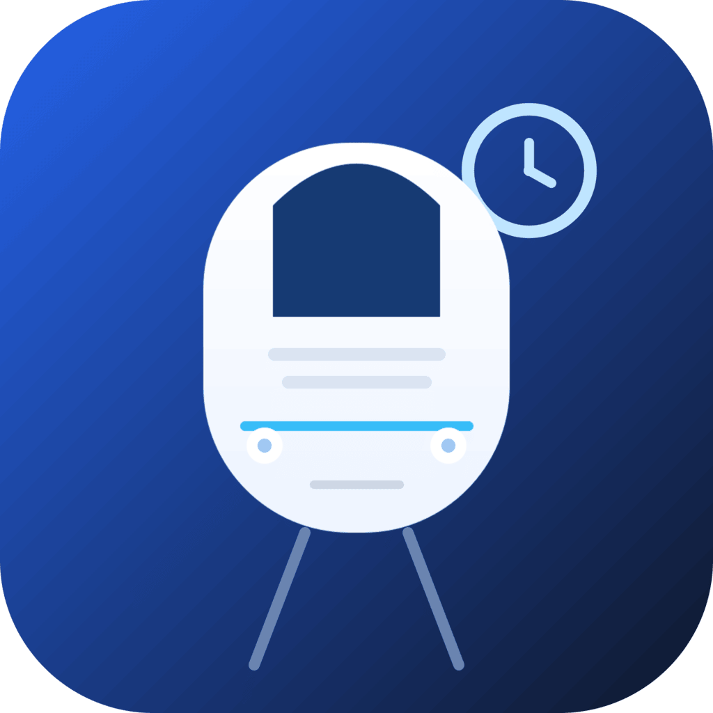
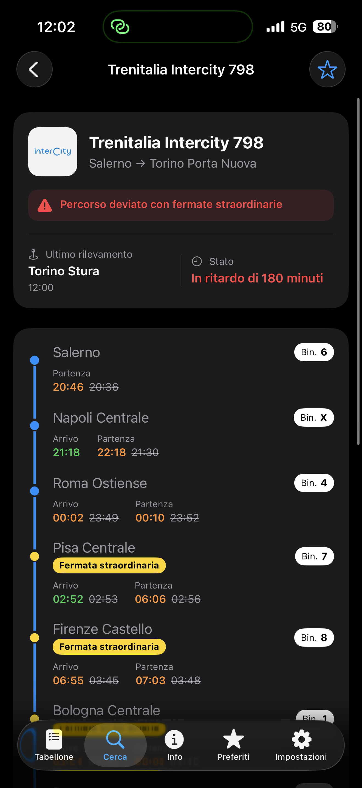
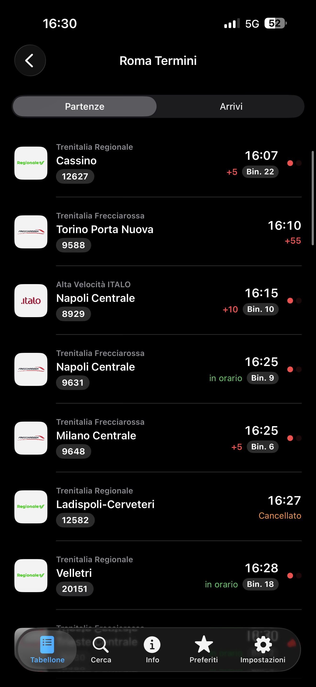
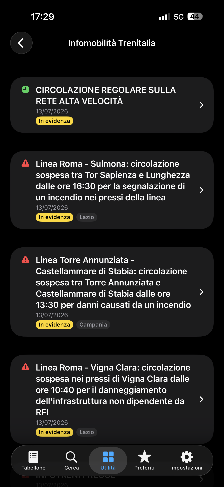
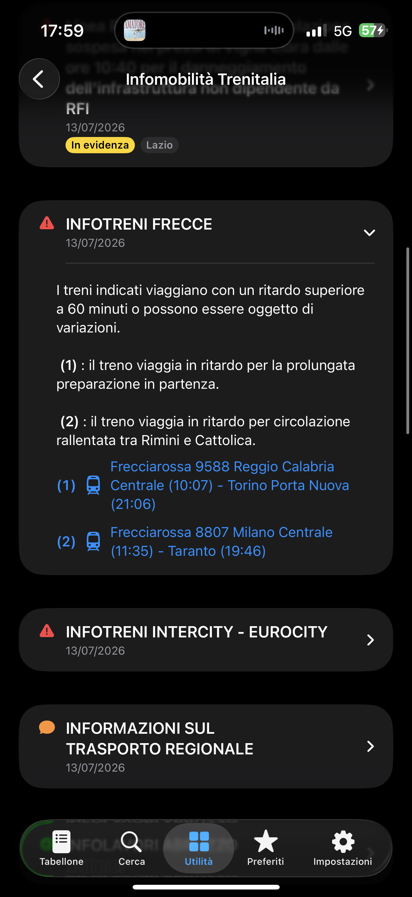
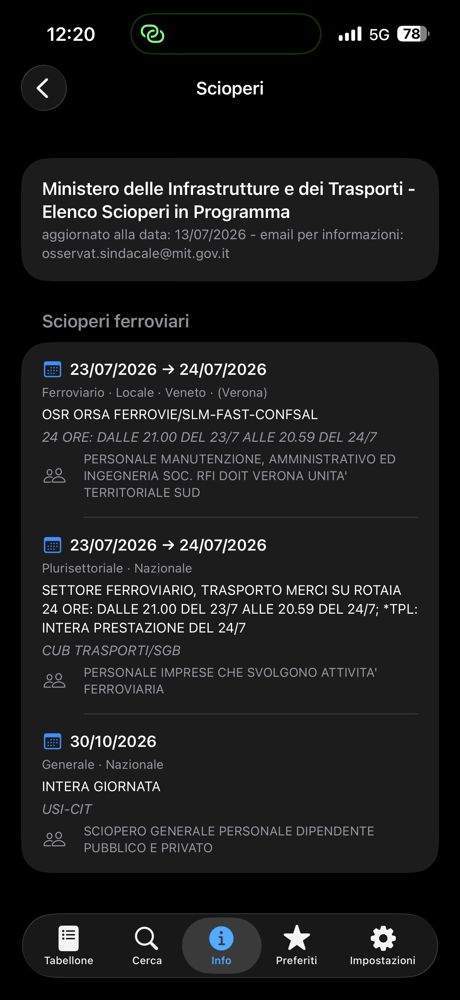
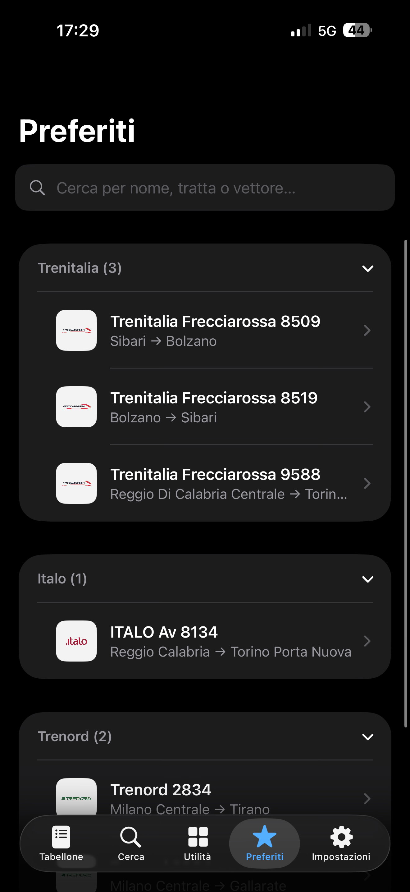
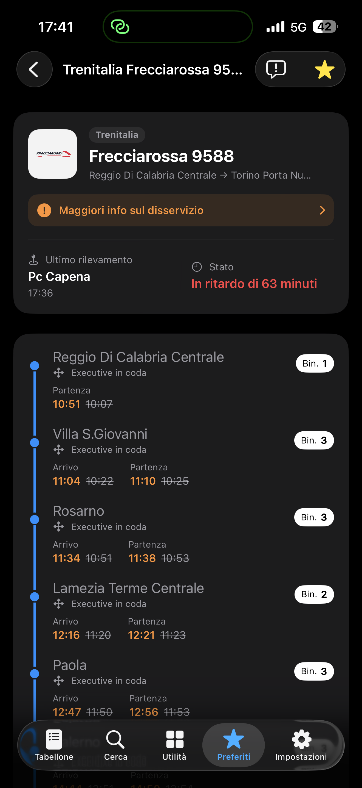

[English](README.md) | **Italiano**

<p align="center"></p>

# Trainly

<p align="center">
  
  
  
  
  <a href="LICENSE"></a>
</p>

<p align="center">
  
  
  
  
  
  
  
</p>

Trainly è un'app iOS nativa per il tracciamento dei treni italiani e la consultazione
di informazioni di viaggio ferroviarie. Aggrega dati in tempo reale da Trenitalia
(ViaggiaTreno), Italo e Trenord dietro un'unica interfaccia uniforme, e aggiunge i
tabelloni partenze/arrivi delle stazioni, la ricerca dei prezzi dei biglietti, gli
avvisi di infomobilità e le informazioni sugli scioperi.

L'app dialoga direttamente con gli endpoint pubblici/non ufficiali dei vettori. Non
usa autenticazione, account né server propri: ogni richiesta è stateless ed emessa
dal dispositivo.

## Requisiti

- iOS 17.6+ (compilata ed eseguita con l'SDK di iOS 26, ciclo di vita SwiftUI)
- Xcode con Swift 5
- Nessuna dipendenza di terze parti; solo framework Apple (SwiftUI, Foundation,
  Combine, CommonCrypto)

App Transport Security: tutti gli endpoint sono HTTPS tranne ViaggiaTreno e il feed
scioperi del MIT, raggiunti via HTTP e dichiarati come eccezioni ATS in
`Info.plist` (`viaggiatreno.it`, `scioperi.mit.gov.it`).

## Architettura

Struttura standard SwiftUI + MVVM-ish, senza framework esterni.

- **`TrainlyApp`** – entry point dell'app. Possiede il `FavoritesStore` condiviso e
  installa il gesto globale di chiusura tastiera.
- **`MainTabView`** – cinque tab (Tabellone, Cerca, Utilità, Preferiti, Impostazioni)
  guidate da `AppRouter`. La tab Utilità usa un `NavigationStack` con path a valori,
  così altre schermate possono spingervi destinazioni via codice.
- **`AppRouter`** (`ObservableObject`) – coordinamento tra tab: tab selezionata,
  path di navigazione di Utilità, una ricerca treno pendente (usata per instradare
  dal tabellone o da un link di infomobilità verso la tab Cerca) e un target di
  infomobilità pendente (usato per saltare dalla pagina di un treno all'avviso
  pertinente).
- **Models** – tipi Codable di richiesta/risposta per ogni vettore più un unico
  modello normalizzato `TrainJourney`/`TrainStop` che la UI di tracciamento
  renderizza, indipendentemente dal vettore di origine. Tutti i campi delle risposte
  grezze sono opzionali per tollerare i JSON incoerenti dei vettori.
- **NetworkRequests** – un service per sorgente dati, ciascuno con funzioni async
  che restituiscono la risposta grezza o un `TrainJourney` normalizzato.
- **Views** – schermate SwiftUI. Gli helper UI condivisi sono in `Theme.swift`
  (`Color.logoTile`, lo sfondo chiaro fisso dietro i loghi dei vettori) e
  `KeyboardDismiss.swift`.

### Il modello di viaggio normalizzato

`TrainJourney` (in `TrainJourney.swift`) unifica i tre vettori tramite adapter
failable/throwing:

- `init(trenitalia:)`, `init?(italo:)`, `init?(trenord:)`

Ogni adapter mappa i campi specifici del vettore su una forma comune: numero treno,
titolo, operatore/categoria (mappata su un asset immagine), origine/destinazione,
ritardo complessivo, ultimo rilevamento (solo Trenitalia) e un array di `TrainStop`.

Ogni `TrainStop` porta orari programmati / previsti / effettivi di arrivo e
partenza, binario (con flag di conferma), flag di fermata effettuata, un'etichetta
opzionale di orientamento carrozze e il flag di "fermata straordinaria".

- Gli **orari previsti** sono calcolati uniformemente come *programmato + ritardo
  attuale* per le fermate non ancora raggiunte, così le fermate future sono colorate
  in modo coerente (verde in orario/anticipo, arancione in ritardo). Italo e Trenord
  forniscono proiezioni proprie ma vengono normalizzati alla stessa regola. Per
  Trenord il ritardo attuale è derivato dall'ultima fermata completata, perché il
  campo `delay` complessivo del feed è inaffidabile.

## Sorgenti dati

| Sorgente | Endpoint | Formato |
| --- | --- | --- |
| Trenitalia (ViaggiaTreno) | `viaggiatreno.it/.../cercaNumeroTrenoTrenoAutocomplete`, `.../andamentoTreno` | testo + JSON |
| Italo | `italoinviaggio.italotreno.com/api/RicercaTrenoService` | JSON |
| Trenord | `trenord.it/mia/bff/train/{id}` | JSON cifrato AES‑256‑ECB |
| Tabellone RFI | `iechub.rfi.it/ArriviPartenze/ArrivalsDepartures/Monitor` | HTML |
| Biglietti (BFF Le Frecce) | `lefrecce.it/Channels.Website.BFF.WEB/website/locations/search`, `.../ticket/solutions` | JSON |
| Catalogo stazioni Trenitalia | `trenitalia.com/content/trenitalia/it.cruscotto-stations.json` | JSON (ISO‑8859‑1) |
| Scioperi MIT | `scioperi.mit.gov.it/mit2/public/scioperi/rss` | RSS/XML |
| Infomobilità Trenitalia | `trenitalia.com/.../notizie-infomobilita.html` | HTML |

Gestioni degne di nota:

- Le risposte **Trenord** sono cifrate. `TrenordService` deriva una chiave AES‑256
  come SHA‑256 di una passphrase fissa e decifra il corpo con CommonCrypto
  (ECB, PKCS7), poi decodifica l'array `[TrenordSolution]` risultante.
- **RFI** e l'**infomobilità Trenitalia** sono estratti dall'HTML con
  `NSRegularExpression` (dot-matches-newlines) perché non esiste un'API JSON.
- Il **feed scioperi** è scaricato via HTTPS con `Accept-Encoding: identity` per
  evitare un corpo gzip che URLSession non decodificherebbe in modo trasparente dopo
  il redirect HTTP→HTTPS.
- Il **catalogo stazioni** è codificato ISO‑8859‑1; viene riconvertito in UTF‑8
  prima della decodifica JSON.

## Funzionalità

### Tracciamento treni (tab Cerca)

- Ricerca di un treno per numero, selezionando il vettore (Trenitalia / Italo /
  Trenord). Un vettore predefinito configurabile (Impostazioni) preseleziona il
  segmento.
- **Fallback silenzioso tra vettori**: se il numero non è trovato sul vettore
  scelto, gli altri vengono interrogati in background; quelli che rispondono
  vengono proposti come alternative ("non trovato su X, ma risulta su Y/Z").
- **Disambiguazione Trenitalia**: l'autocomplete di ViaggiaTreno può restituire più
  corse per lo stesso numero. Le corse che differiscono solo per il giorno (stessa
  origine) aprono quella odierna e mostrano un **selettore data** segmented nella
  pagina di dettaglio; corse davvero diverse (origine diversa) presentano un foglio
  di scelta.
- Le ricerche recenti sono persistite e mostrate nella schermata Cerca; toccandone
  una si riesegue la ricerca.

La pagina di dettaglio del treno (`TrainView`) mostra:

- Un header con il vettore come badge, tipo treno + numero come titolo, il logo del
  vettore (su sfondo chiaro fisso), origine → destinazione, la posizione (ultimo
  rilevamento per Trenitalia, prossima fermata altrimenti) e lo stato del ritardo
  (verde = in orario/anticipo, arancione = in ritardo, con minuti di anticipo o
  ritardo).
- Un banner rosso quando la corsa è cancellata/modificata/deviata (dal `subTitle`
  di Trenitalia), oppure un banner arancione "Maggiori info sul disservizio" che
  porta all'avviso di infomobilità corrispondente quando il treno ne è colpito
  (solo se aperto da ricerca/tabellone, non dall'infomobilità stessa).
- Una **timeline** verticale di ogni fermata con indicatore colorato, orario
  programmato (barrato se diverso), orario "vivo" (effettivo o previsto), il binario
  come badge (chiaro = programmato, scuro = confermato), le **fermate
  straordinarie** evidenziate in giallo e, per Trenitalia, l'orientamento carrozze
  ("Executive in coda/testa").
- Un **selettore data** quando la stessa corsa esiste su più giorni.
- Pull-to-refresh, il toggle preferiti e un pulsante di segnalazione.

### Tabellone stazione (tab Tabellone)

- Un selettore stazione con autocompletamento sul catalogo RFI incorporato
  (~2400 stazioni mappate sui rispettivi place id RFI), una sezione "Recenti"
  persistita in `UserDefaults` e una sezione "Principali" di accesso rapido.
- `StationBoardView` estrae il monitor arrivi/partenze RFI e mostra un controllo
  segmented Partenze/Arrivi. Ogni riga mostra il logo dell'operatore, l'etichetta
  operatore + categoria, la destinazione/provenienza, il numero treno come badge,
  il ritardo, il binario e un indicatore animato stile passaggio a livello (due luci
  rosse alternate, sincronizzate tra le righe) quando il treno è in arrivo o in
  partenza.
- Il tocco su un treno lo apre in loco (nella tab Tabellone), così il back riporta
  al tabellone. I cambi di segmento svuotano la lista e ricaricano; i caricamenti
  sono sicuri rispetto alla cancellazione per evitare falsi errori nei cambi rapidi.

### Ricerca biglietti (Utilità → Cerca Biglietto)

Consultazione di prezzi e orari tramite il BFF di prenotazione Le Frecce (solo
ricerca; l'acquisto non è supportato).

- I campi stazione usano suggerimenti locali istantanei dal catalogo stazioni
  Trenitalia in cache; l'id numerico richiesto dalla ricerca è risolto alla
  selezione.
- Un form di ricerca: origine/destinazione (con inverti e resetta), data/ora, numero
  passeggeri e un filtro categoria (Frecce / Intercity / Regionali) passato all'API.
- I risultati si aprono in una pagina dedicata con filtri lato client (operatore
  Trenitalia/Trenord, solo diretti). Ogni riga mostra la catena di treni, gli orari,
  la durata, diretto/cambi, il prezzo minimo e lo stato di disponibilità.
- La pagina di dettaglio elenca i treni (con stazioni, utile per i cambi) e le
  **classi di prezzo collassabili** (STANDARD/PREMIUM/BUSINESS/EXECUTIVE o le classi
  regionali), ognuna con le sue tariffe, posti rimanenti e flag
  modificabile/rimborsabile, più una legenda. Sono gestiti i treni Trenord che
  compaiono nei risultati Trenitalia e le ricerche multi-stazione ("Tutte le
  stazioni"), etichettate con la stazione specifica.

### Infomobilità (Utilità → Infomobilità)

- Estrae la pagina infomobilità di Trenitalia e mostra ogni avviso come card
  collassabile (tutte chiuse di default), preservando l'ordine del sito.
- Il colore di severità della left-bar del sito è riflesso con un'icona colorata
  (pericolo/rosso, messaggio/arancione, orologio/verde) e i tag sono riprodotti come
  badge ("In evidenza" evidenziato in giallo).
- I corpi degli avvisi preservano grassetti e spaziatura dei paragrafi. I link sono
  classificati: i link a treni reali aprono la pagina del treno in-app, il link
  generico "cerca treno" apre la tab Cerca, i link a documenti/pagine si aprono nel
  browser.
- Si aggiorna a ogni apertura; può fare deep-link ed espandere l'avviso relativo a
  un treno specifico.

### Scioperi (Utilità → Scioperi)

- Analizza il feed RSS del Ministero dei Trasporti e filtra gli scioperi rilevanti
  per il ferro: il settore esatto "Ferroviario", tutti i "Generale" e i
  "Plurisettoriale" che citano il ferroviario in un campo qualsiasi.
- Ogni voce mostra l'intervallo di date, il settore, la rilevanza (con
  regione/provincia per gli scioperi locali, solo la rilevanza per i nazionali), i
  campi sindacati/modalità (che il feed a volte inverte, quindi entrambi mostrati
  differenziati) e la categoria interessata.
- In cache e aggiornato al massimo una volta al giorno.

### Preferiti

- I treni si aggiungono con la stella dalla pagina di dettaglio e sono persistiti in
  `UserDefaults`.
- La lista è raggruppata in sezioni collassabili per vettore e ricercabile per nome,
  tratta, vettore o numero; le voci supportano lo swipe per eliminare.

### Impostazioni

- Vettore predefinito (applicato immediatamente), tema dell'app
  (Sistema/Chiaro/Scuro), un placeholder per le notifiche e l'accesso ai moduli di
  segnalazione.

### Segnalazioni

- Un modulo di segnalazione modale è disponibile da ogni pagina treno (precompilato
  con numero e tratta, con un selettore del tipo di problema) e dalle Impostazioni
  (un form segmented Treno/Ricerca). L'invio non è ancora implementato (work in
  progress).

## Comportamenti trasversali

- **Chiusura tastiera globale** – un tap a livello di finestra e uno swipe verso il
  basso chiudono la tastiera ovunque nell'app, senza cablaggio per singolo campo. Un
  modificatore `modalKeyboardSafe()` impedisce che le sheet vengano chiuse con lo
  swipe mentre la tastiera è visibile.
- **Persistenza** – preferiti, treni recenti, stazioni recenti, tema e vettore
  predefinito, il catalogo stazioni in cache e il feed scioperi in cache sono tutti
  persistiti localmente; i due cataloghi vengono ricontrollati al massimo
  settimanalmente/giornalmente e riscritti solo se il contenuto è cambiato.
- **Mappatura immagini** – ogni treno è mappato su un asset immagine di
  vettore/categoria (Frecciarossa, Frecciargento, Frecciabianca, Intercity,
  regionale Trenitalia, Trenitalia TPER, Leonardo Express, Italo, Trenord), inclusi
  i treni Trenord che compaiono nei risultati Trenitalia.

## Struttura del progetto

```
Trainly/
  TrainlyApp.swift          Entry point dell'app
  MainTabView.swift         Tab bar e navigation stack di Utilità
  Models/                   Modelli Codable, viaggio normalizzato, store
  NetworkRequests/          Un service per sorgente dati
  Views/                    Schermate SwiftUI e helper UI condivisi
  Assets.xcassets/          Icona app e loghi dei vettori
```

## Disclaimer

Trainly è un client non ufficiale e non è affiliato a Trenitalia, Italo, Trenord,
RFI o al Ministero dei Trasporti. I dati provengono così come sono da endpoint di
terze parti e possono essere imprecisi o non disponibili. La funzione biglietti è
solo di consultazione; per l'acquisto rivolgersi ai canali ufficiali o ai
rivenditori autorizzati.

## Configurazione

Il feed di Trenord è cifrato. La sua passphrase non è nel repository: copia
`Trainly/Config/TrenordKey.example.plist` in `Trainly/Config/TrenordKey.plist` (escluso da git) e imposta il
valore `key`. Senza il file l'app funziona normalmente e i treni Trenord risultano non configurati.

## Licenza

Codice consultabile con la [PolyForm Strict License 1.0.0](LICENSE): si può leggere ed eseguire per scopi non
commerciali; non si può modificare, ridistribuire né pubblicare senza permesso scritto. Il nome "Trainly" e la sua
icona sono riservati. Nomi e loghi dei vettori appartengono ai rispettivi titolari.

---

<sub>© 2026 [Mattia Meligeni](https://mattiameligeni.com)</sub>
